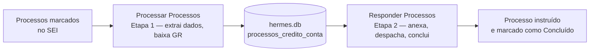

# Programa SEI

> Automação da instrução de processos de Crédito em Conta no SEI, para a Superintendência de Contabilidade e Controle (SUPCONC) do Tesouro Estadual — SEFAZ-RJ.

O **Programa SEI** é uma aplicação desktop (interface gráfica em `customtkinter`) que automatiza o fluxo de **Crédito em Conta**: para cada processo marcado no SEI, o programa localiza os anexos, extrai os dados do comprovante, obtém a Guia de Recolhimento (GR) correspondente e instrui o processo com o despacho padrão. É um programa irmão do [Programa Hermes](../Programa%20Hermes), do qual este módulo foi extraído para funcionar de forma independente.

A partir do menu principal (após o login do SEI), o programa oferece dois módulos: **Crédito em Conta** (implementado) e **Depósito Judicial** (reservado para uma futura expansão). Dentro de Crédito em Conta, as duas etapas do fluxo — coletar e finalizar — são disparadas por botões independentes: **Processar Processos** (Etapa 1, pede login do SIAFE-Rio na hora) e **Responder Processos** (Etapa 2, não precisa do SIAFE).

---

## Índice

- [Visão geral](#visão-geral)
- [Arquitetura](#arquitetura)
- [Fluxo de login](#fluxo-de-login)
- [Estrutura de diretórios](#estrutura-de-diretórios)
- [Pré-requisitos](#pré-requisitos)
- [Instalação](#instalação)
- [Configuração](#configuração)
- [Banco de dados](#banco-de-dados)
- [Como usar](#como-usar)
- [Etapas do processamento](#etapas-do-processamento)
- [Protocolo do subprocesso](#protocolo-do-subprocesso)
- [Logs e notificação de erros](#logs-e-notificação-de-erros)
- [Dependências](#dependências)
- [Solução de problemas (FAQ)](#solução-de-problemas-faq)

---

## Visão geral

O programa abre direto na tela de login do **SEI**; ao logar, cai no **menu principal**, com dois módulos: **Crédito em Conta** e **Depósito Judicial** (este último ainda em desenvolvimento).

Dentro de **Crédito em Conta**, a tela de execução tem dois botões, um para cada etapa do fluxo:

- **Processar Processos** (Etapa 1 — Coletar): antes de rodar, pede o login do **SIAFE-Rio** (necessário para localizar/baixar a GR); em seguida percorre os processos marcados no SEI com `PGE - Credito em Conta - Processar`, extrai os dados do anexo da PGE e localiza (ou baixa) a Guia de Recolhimento.
- **Responder Processos** (Etapa 2 — Finalizar): não pede login adicional (usa apenas o login do SEI já feito na abertura); anexa os documentos ao processo, inclui o despacho padrão e troca o marcador para `PGE - Credito em Conta - Concluido`.



A opção **Depósito Judicial** aparece no menu como reservada para uma futura expansão do programa.

---

## Arquitetura

O Programa SEI é construído sobre as mesmas bibliotecas internas do Tesouro usadas pelo Programa Hermes:

- **`TesouroEOP-UI`** (`eop_ui`) — fornece a base da interface: `BaseApp` (janela, telas de login/execução, barra de progresso, botões padronizados) e `AppConfig` (identidade visual, regras dos campos de login).
- **`jupiter-subtes`** (`jupiter`) — fornece a lógica de integração: `SEI` (automação do SEI), `Siafe` (download de GR no SIAFE-Rio), `GraphAPI` (envio de e-mail e Teams via Microsoft Graph) e `configurar_log`.
- **`automaweb`** — wrapper de Selenium usado para a automação do site de resgate do Banco do Brasil.

O código se divide em camadas:

```
Interface + orquestração ......... main.py
Automação SEI (subprocesso) ...... run_processar_cc.py + processar_cc/
Persistência ..................... base de dados/hermes.db (SQLite, compartilhado com o Programa Hermes)
```

Pontos importantes do desenho:

- **Subprocesso** — cada etapa do Crédito em Conta roda como processo filho (`subprocess.Popen`, via `run_processar_cc.py etapa1|etapa2`), para não travar a interface nem arriscar a estabilidade da janela principal com a automação Selenium-heavy. As credenciais são passadas por `stdin` em JSON e o progresso volta pela `stdout` com o prefixo `__PROGRESSO__:atual:total`.
- **Duas etapas independentes na interface** — o pacote `processar_cc` separa o trabalho em **Etapa 1 (coletar)** e **Etapa 2 (finalizar)**, cada uma disparada por um botão próprio (**Processar Processos** / **Responder Processos**), com checkpoint na tabela `processos_credito_conta`: se o programa for interrompido entre as duas etapas, a próxima execução de "Responder Processos" retoma de onde parou.
- **Thread na interface** — a leitura do subprocesso roda em uma *thread* separada, para não travar a interface. O botão **Cancelar** sinaliza a parada via `stop_event` e encerra o processo filho.

---

## Fluxo de login

O Programa SEI standalone pede o login do **SEI** logo na abertura, antes do menu principal; o login do **SIAFE-Rio** só é pedido depois, sob demanda, ao clicar em **Processar Processos** (Etapa 1) — que é o único ponto do fluxo que precisa dele.

1. **Login do SEI** (na abertura) — usuário e senha do SEI (sem restrição de formato). Válido durante toda a sessão, inclusive para a Etapa 2.
2. **Login do SIAFE-Rio** (ao clicar em "Processar Processos") — CPF (11 dígitos) e senha, necessário para localizar/baixar a Guia de Recolhimento. Feito com sucesso, a Etapa 1 já é disparada automaticamente na Tela de Execução.

Ambas as telas reaproveitam o mesmo componente de login do `eop_ui.BaseApp` (`show_login_frame`), alternando a identidade visual (`self.cfg`) entre uma chamada e outra — o mesmo padrão usado pelo Hermes para simular múltiplas telas de login com uma única classe de app.

Se o login do SEI falhar (código de saída `3` na Etapa 2), o programa volta para a tela de login do **SEI**. Se o login do SIAFE falhar (código `3` na Etapa 1), o programa volta para a tela de login do **SIAFE**, sem perder o login do SEI já feito. Cancelar a tela de login do SIAFE volta para a Tela de Execução do Crédito em Conta, sem sair do módulo.

---

## Estrutura de diretórios

```
Programa SEI/
├── main.py                  # Aplicação principal (interface + orquestração)
├── exe.py                   # Launcher fino usado pelo executável empacotado
├── run_processar_cc.py      # Entry-point do subprocesso (roda processar_cc/main.py)
├── requirements.txt         # Dependências Python
├── config.example.json      # Modelo de configuração (copiar para config.json)
├── config.json              # Credenciais de notificação  ← NÃO versionado
│
├── processar_cc/            # Automação do Crédito em Conta
│   ├── main.py              #   Entry-point: lê stdin, roda etapa1_coletar + etapa2_finalizar
│   ├── orchestrator.py      #   Casos de uso: coleta e finalização em lote
│   ├── services.py          #   Integrações externas (BB, SIAFE, SEI)
│   ├── extractors.py        #   Extração de dados dos PDFs (Strategy Pattern)
│   ├── core.py               #   Exceções, dataclasses, persistência (Repository Pattern)
│   ├── utils.py              #   Funções utilitárias (regex, formatação, arquivos)
│   └── config.py             #   Constantes de negócio, URLs, caminhos
│
├── driver/
│   └── msedgedriver.exe     # WebDriver do Edge (cópia do usado pelo Programa Hermes)
│
├── img/                     # Ícones e logotipos da interface
├── logs/                    # Log de erros local  ← NÃO versionado
└── env/                     # Ambiente virtual (opcional)
```

Conforme o [.gitignore](.gitignore), **não** são versionados: `base de dados/`, `logs/`, arquivos `*.pdf`, `__pycache__/` e o `config.json`.

---

## Pré-requisitos

- **Windows** (o programa usa `os.getlogin()`, caminhos de rede `\\cifs-zone1\...` e `CREATE_NO_WINDOW`).
- **Python 3.10+**.
- Acesso à rede corporativa do Tesouro (o banco de dados, o log geral e a pasta de GRs ficam em compartilhamentos `\\cifs-zone1\tesouro\...`).
- Credenciais válidas do **SEI** e do **SIAFE-Rio**.
- **Microsoft Edge** instalado (o `msedgedriver.exe` já acompanha o repositório, na pasta `driver/`).

---

## Instalação

1. **Clone o repositório**

   ```bash
   git clone <url-do-repositorio>
   cd "Programa SEI"
   ```

2. **Crie e ative um ambiente virtual** (recomendado)

   ```powershell
   python -m venv env
   .\env\Scripts\Activate.ps1
   ```

3. **Instale as dependências**

   ```bash
   pip install -r requirements.txt
   ```

   > As bibliotecas `TesouroEOP-UI`, `jupiter-subtes` e `automaweb` são internas. Certifique-se de que o `pip` esteja configurado para acessar o índice de pacotes do Tesouro; caso contrário, a instalação delas falhará.

4. **Configure a notificação de erros** (opcional, veja a seção seguinte)

   ```bash
   copy config.example.json config.json
   ```

5. **Execute**

   ```bash
   python main.py
   ```

---

## Configuração

### `config.json` — notificação de erros

Ao **fechar** o programa, ele envia um resumo dos erros críticos da sessão por e-mail e/ou Microsoft Teams. Essas credenciais ficam no `config.json` (não versionado). Copie o modelo e preencha:

```json
{
  "graph_api": {
    "tenant_id": "<ID do tenant do Azure AD>",
    "client_id": "<ID do aplicativo registrado no Azure>",
    "client_secret": "<segredo do aplicativo>",
    "conta_corporativa": "conta.corporativa@fazenda.rj.gov.br"
  },
  "desenvolvedores": [
    "desenvolvedor1@fazenda.rj.gov.br",
    "desenvolvedor2@fazenda.rj.gov.br"
  ],
  "webhook_teams": "https://<sua-organizacao>.webhook.office.com/webhookb2/..."
}
```

| Situação | Efeito |
| --- | --- |
| Arquivo ausente ou inválido | A notificação é **desativada** silenciosamente (o programa segue funcionando). |
| `graph_api` incompleto | Nenhuma notificação é enviada (o `GraphAPI` não é instanciado). |
| `desenvolvedores` preenchido | Envia o resumo por **e-mail** aos endereços listados. |
| `webhook_teams` preenchido | Publica o resumo no **canal do Teams** correspondente. |

### Constantes de negócio (`processar_cc/config.py`)

Contas monitoradas, URLs do SIAFE/BB, marcadores do SEI e caminhos de rede (banco de dados, pasta de GRs, log geral) ficam centralizados nesse arquivo — ajuste com cuidado, são a materialização das regras de negócio do fluxo.

---

## Banco de dados

O Programa SEI **compartilha** o mesmo banco SQLite do Programa Hermes, em `\\cifs-zone1\tesouro\Programas da SUPCONC\Programa Hermes\base de dados\hermes.db` (constante `CAMINHO_HERMES` em `processar_cc/config.py`). Essa decisão preserva duas vantagens:

- O módulo consegue localizar GRs já contabilizadas pelo módulo PRJ do Hermes (tabela `contabilizacoes`), evitando um novo download quando possível.
- Não é necessário manter dois bancos sincronizados.

### Tabela `processos_credito_conta`

Criada dinamicamente pelo próprio programa na primeira execução (`processar_cc/core.py::inicializar_tabela_processos`), como checkpoint das duas etapas do fluxo:

```sql
CREATE TABLE IF NOT EXISTS processos_credito_conta (
    id                   INTEGER PRIMARY KEY AUTOINCREMENT,
    processo             TEXT    NOT NULL,
    status               TEXT    NOT NULL DEFAULT 'pendente',
    conta                TEXT,
    conta_judicial       TEXT,
    processo_judicial    TEXT,
    data_pagamento       TEXT,
    ano                  INTEGER,
    valor_pesquisa       REAL,
    caminho_comprovante  TEXT,
    caminho_gr           TEXT,
    num_doc              TEXT,
    cnpj                 TEXT,
    data_alvara          TEXT,
    index_doc            TEXT,
    tem_gr               INTEGER DEFAULT 0,
    tem_comprovante      INTEGER DEFAULT 0,
    tem_despacho_apos_gr INTEGER DEFAULT 0,
    usuario_resposta     TEXT,
    data_hora_resposta   TEXT,
    tempo_resposta       REAL
);
```

O programa só **lê** a tabela `contabilizacoes` do Hermes — nunca grava nela.

---

## Como usar

1. **Abra o programa** e faça login com usuário e senha do **SEI**.
2. No menu principal, clique em **Crédito em Conta**.
3. Na Tela de Execução, clique em **Processar Processos** para rodar a Etapa 1:
   - o programa primeiro pede o login com **CPF e senha do SIAFE-Rio**;
   - feito o login, roda como subprocesso: percorre os processos marcados no SEI, extrai os dados e baixa/localiza a GR. A barra de progresso e o log acompanham o lote.
4. Quando a Etapa 1 terminar (e retornar à Tela de Execução), clique em **Responder Processos** para rodar a Etapa 2:
   - não pede login adicional (reaproveita o login do SEI já feito);
   - anexa os documentos, inclui o despacho padrão e conclui cada processo coletado na etapa anterior.
5. Ao final de cada etapa, o programa exibe o resultado e retorna à Tela de Execução automaticamente após alguns segundos.

### Cancelando uma operação

Durante a execução (Etapa 1 ou Etapa 2), o botão **Cancelar** sinaliza a parada e encerra o subprocesso. Processos já concluídos permanecem marcados como tal no SEI e no banco.

---

## Etapas do processamento

O pacote `processar_cc` separa o fluxo em duas etapas (`processar_cc/orchestrator.py`), cada uma persistida no banco:

1. **Etapa 1 — Coletar** (`etapa1_coletar`): para cada processo do marcador `PGE - Credito em Conta - Processar`, mapeia a árvore de documentos, extrai os dados do anexo da PGE, valida a conta, determina a versão do SIAFE conforme o ano do documento e baixa (ou localiza em disco) a Guia de Recolhimento. Grava `status="dados_coletados"` — ainda sem tocar nos anexos/despacho do processo.
2. **Etapa 2 — Finalizar** (`etapa2_finalizar`): busca no banco os processos com `status="dados_coletados"`, reabre a sessão do SEI, anexa comprovante e GR, inclui o despacho padrão (valor por extenso via `num2words`), inclui o processo no bloco de assinatura da COOCCB e troca o marcador para `Concluido`. Grava `status="concluido"`.

Essa separação com checkpoint em banco permite retomar de onde parou caso o programa seja interrompido entre as duas etapas.

---

## Protocolo do subprocesso

`main.py` invoca `run_processar_cc.py etapa1|etapa2` via `subprocess.Popen`, um processo novo a cada clique em **Processar Processos** ou **Responder Processos**, seguindo o mesmo contrato usado pelo Programa Hermes:

- **Argumento (argv[1])** — `etapa1` ou `etapa2`, conforme o botão clicado.
- **Entrada (stdin)** — um único JSON, escrito uma vez e depois `stdin.close()`:
  ```json
  {"sei_user": "...", "sei_pass": "...", "siafe_user": "...", "siafe_pass": "..."}
  ```
  Na `etapa2`, os campos `siafe_user`/`siafe_pass` são enviados vazios — `processar_cc/main.py` só exige `sei_user`/`sei_pass` nesse caso.
- **Saída (stdout)**, lida linha a linha:
  - `__PROGRESSO__:{atual}:{total}` → atualiza a barra de progresso.
  - `INFO:`/`WARNING:`/`ERROR:` + mensagem → vai para o log da interface (e para o logger Python, se for `ERROR`).
  - Qualquer outra linha não vazia → log genérico.
- **Código de saída**:

  | Código | Significado | Mensagem na interface |
  | --- | --- | --- |
  | `0` | Sucesso total | "Processo concluído com sucesso!" |
  | `2` | Parcial (alguns processos pulados) | "Concluído com Alertas" |
  | `3` | Falha de login | "Erro de Login" — volta à tela de login do SIAFE (se `etapa1`) ou do SEI (se `etapa2`) |
  | outro | Erro crítico | "Finalizado com Erros (código N)" |

> O subprocesso força `PYTHONUNBUFFERED=1` e `PYTHONIOENCODING=utf-8` para que a interface leia o progresso e os logs em tempo real, linha a linha.

---

## Logs e notificação de erros

O Programa SEI mantém **dois destinos de log**, configurados por `configurar_log` (da lib `jupiter`):

- **Log geral** — gravado no compartilhamento de rede
  `\\cifs-zone1\tesouro\Programas da SUPCONC\logs\Programa SEI`.
- **Log de erros local** — na pasta `logs/` do próprio projeto.

Um *handler* customizado, `ColetorErros`, acumula **todos** os `logger.error()` da sessão (do app e da biblioteca `jupiter`). Ao fechar o programa, esses erros são compilados em um único resumo e enviados por e-mail e/ou Teams, se o `config.json` estiver configurado.

---

## Dependências

Principais pacotes (veja [requirements.txt](requirements.txt) para as versões exatas):

| Pacote | Uso |
| --- | --- |
| `customtkinter` | Interface gráfica |
| `selenium` / `undetected-chromedriver` | Automação do navegador |
| `pdfplumber` | Extração de texto de PDFs (GR, comprovantes, anexos) |
| `num2words` | Conversão de valores por extenso (texto do despacho) |
| `automaweb` | Automação do site de resgate do Banco do Brasil |
| `TesouroEOP-UI` | Base da interface (`eop_ui`) — biblioteca interna |
| `jupiter-subtes` | Integrações SEI/SIAFE/Graph (`jupiter`) — biblioteca interna |

---

## Solução de problemas (FAQ)

**"Nenhum processo pendente encontrado".**
Não há processos marcados com `PGE - Credito em Conta - Processar` no SEI. Confirme que o marcador foi aplicado aos processos corretos.

**Falha no login do SEI ou do SIAFE.**
O código de saída `3` do subprocesso devolve automaticamente à tela de login correspondente após 3 segundos: login do SIAFE se a falha foi na Etapa 1 ("Processar Processos"), login do SEI se foi na Etapa 2 ("Responder Processos"). Confirme usuário e senha.

**Erro crítico com o navegador.**
Falhas de sessão do Selenium (`SessionNotCreatedException`, `InvalidSessionIdException`) exigem reiniciar o programa. Confirme que o Edge e o `msedgedriver.exe` são compatíveis.

**A notificação de erros não chega.**
Verifique se o `config.json` existe e está completo. Ausente ou incompleto, a notificação é desativada silenciosamente (por design).

**As bibliotecas internas não instalam.**
`TesouroEOP-UI`, `jupiter-subtes` e `automaweb` vêm do índice interno do Tesouro. Ajuste a configuração do `pip` para acessá-lo.

---

<p align="center"><sub>Programa SEI · versão 1.0.0 · Tesouro Estadual — SUPCONC / SEFAZ-RJ</sub></p>
